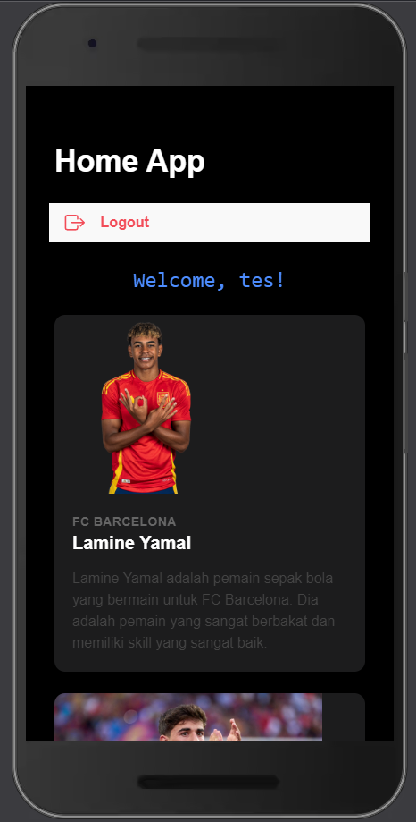

# Langkah untuk Proses Login di Ionic

Fawwaz Afkar Muzakky (H1D022067) Shift C

### 1. **Membuat Form Login**

   - Pada `login.page.html`, tambahkan elemen form untuk `email` dan `password` dengan `ion-input`
   - Buat file `login.page.ts` dan tambahkan fungsi `login()` untuk menangani login pengguna

### 2. **Membuat AuthService untuk Menangani Login**

   - Buat sebuah service bernama `AuthService` menggunakan Angular CLI
   - Dalam `authentication.service.ts`, tambahkan fungsi `login` yang menggunakan `HttpClient` untuk mengirim data login ke API

### 3. **Memanggil AuthService dari Login Page**

   - Di `login.page.ts`, panggil `AuthService` dan kirim data form jika `loginForm` valid

### 4. **Membuat Auth Guard untuk Rute Terproteksi**

   - Buat guard bernama `AuthGuard` untuk memastikan pengguna hanya bisa mengakses halaman home jika sudah login

### 5. **Membuat Fungsi Logout**

   - Tambahkan tombol logout di `home.page.html`, dan buat fungsi `logout`

# Tampilan

## Screenshot

## Video Demo
<video src="https://github.com/user-attachments/assets/15e06fb6-b56a-4d58-bf9c-78d63e5509b5" width="500px" controls></video>

